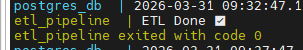
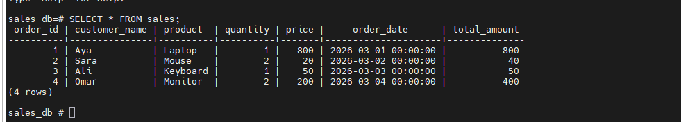

# Containerized Data Pipeline using Docker

## Overview
This project demonstrates a practical end-to-end data pipeline using Docker, Python, and PostgreSQL.

The pipeline extracts data from a CSV file, performs cleaning and transformation, and loads the processed data into a PostgreSQL database.

---

## Architecture

CSV File → Python ETL → PostgreSQL (Dockerized)

- Extract: Read raw data from CSV  
- Transform: Clean and enrich data using Pandas  
- Load: Store processed data into PostgreSQL  

---

## Tech Stack

- Python (Pandas, SQLAlchemy)
- PostgreSQL
- Docker
- Docker Compose

---

## Project Structure

```
docker-data-pipeline/
│
├── data/
│   └── sales.csv
│
├── etl/
│   ├── etl.py
│   ├── requirements.txt
│   └── Dockerfile
│
├── docker-compose.yml
└── README.md
```

---

## How It Works

1. Docker Compose starts:
   - PostgreSQL container  
   - ETL container  

2. The ETL script:
   - Reads CSV data  
   - Removes duplicates and null values  
   - Converts data types  
   - Creates a new column (total_amount)  
   - Loads data into PostgreSQL  

---

## Running the Project

```bash
docker compose up --build
```

---

## Sample Output

### ETL Execution



### Data Stored in PostgreSQL



---

## Verifying the Data

```bash
docker exec -it postgres_db psql -U aya -d sales_db
```

```sql
SELECT * FROM sales;
```

---

## Data Persistence

Docker volumes are used to ensure that data remains محفوظ حتى بعد إيقاف أو حذف الـ containers.

---

## Key Features

- End-to-end ETL pipeline  
- Containerized environment using Docker  
- Automated data processing  
- Persistent database storage  

---

## Skills Demonstrated

- Data Engineering Fundamentals  
- ETL Pipeline Development  
- Docker & Containerization  
- Database Integration  
- Data Cleaning and Transformation  

---

## Future Improvements

- Add workflow orchestration using Apache Airflow  
- Implement logging and monitoring  
- Add data validation checks  
- Extend pipeline to support multiple data sources  

---

## Author

Aya Gamal  
Data Engineering Enthusiast
